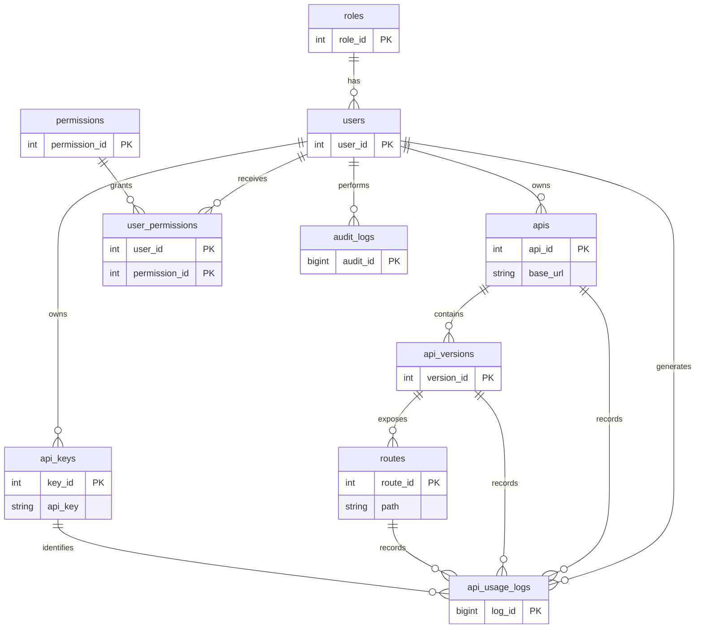

# Database ERD

```mermaid
erDiagram
    roles ||--o{ users : has
    users ||--o{ apis : owns
    apis ||--o{ api_versions : contains
    api_versions ||--o{ routes : exposes
    users ||--o{ user_permissions : receives
    permissions ||--o{ user_permissions : grants
    users ||--o{ api_keys : owns
    users ||--o{ api_usage_logs : generates
    apis ||--o{ api_usage_logs : records
    api_versions ||--o{ api_usage_logs : records
    routes ||--o{ api_usage_logs : records
    api_keys ||--o{ api_usage_logs : identifies
    users ||--o{ audit_logs : performs

    roles { int role_id PK }
    users { int user_id PK }
    apis { int api_id PK string base_url }
    api_versions { int version_id PK }
    routes { int route_id PK string path }
    permissions { int permission_id PK }
    user_permissions { int user_id PK int permission_id PK }
    api_keys { int key_id PK string api_key }
    api_usage_logs { bigint log_id PK }
    audit_logs { bigint audit_id PK }
```
